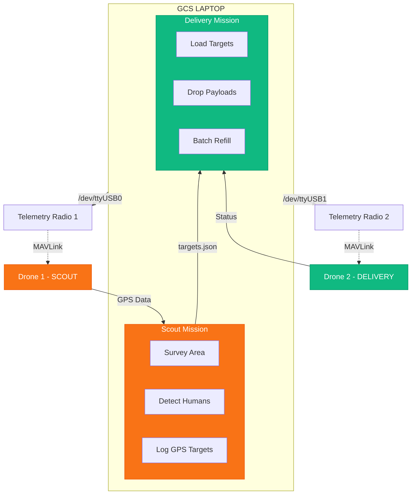

# Multi-Drone Mission Orchestrator

A Python system for orchestrating dual-drone missions with Scout (survey/detection) and Delivery (payload drop) capabilities using pymavlink.

## Overview

This system controls two drones via USB telemetry radios:

- **Drone 1 (Scout)**: Surveys a KML-defined area, detects humans using YOLO+BoT-SORT, logs GPS coordinates
- **Drone 2 (Delivery)**: Performs payload drops at detected locations in batches



## Features

- **Lawnmower Survey Pattern**: Efficient coverage paths from KML polygons
- **Real-time Human Detection**: YOLO+BoT-SORT tracking with unique counting
- **RTSP Video Feed**: Live video display with detection overlays
- **GPS Geotagging**: Logs detected human locations with coordinates
- **Batch Payload Delivery**: Payload capacity management with refill workflow
- **Safety Features**: Battery monitoring, GPS/EKF checks, RTL failsafe

## Project Structure

```
ELKa-2026-Final-Mission-/
├── main.py                # Main orchestration script
├── config.py              # Central configuration
├── drone_controller.py    # MAVLink wrapper class
├── kml_processor.py       # KML parsing + path generation
├── human_detector.py      # YOLO+BoT-SORT detection
├── video_display.py       # RTSP viewer with overlays
├── scout_mission.py       # Scout drone logic
├── delivery_mission.py    # Delivery drone logic
├── requirements.txt       # Python dependencies
├── tests/
│   ├── test_drone_connection.py  # Drone connectivity test
│   ├── test_rtsp_stream.py       # Video stream test
│   └── test_kml_path.py          # Path planning test
├── config/
│   └── survey_area.kml    # Survey area definition
├── models/
│   └── best.pt            # YOLO model weights
└── output/
    └── targets.json       # Detected human locations
```

## Installation

```bash
cd /home/dj/Projects/ELKa-2026-Final-Mission-
pip install -r requirements.txt
```

## Configuration

Edit `config.py` to customize mission parameters:

```python
class MissionConfig:
    # Connections
    SCOUT_CONNECTION = "/dev/ttyUSB0"
    DELIVERY_CONNECTION = "/dev/ttyUSB1"
    
    # Altitudes
    SCOUT_ALTITUDE = 10.0       # Survey altitude (m)
    DELIVERY_ALTITUDE = 10.0    # Cruise altitude (m)
    DROP_ALTITUDE = 5.0         # Descend to this for drops (m)
    
    # Payload
    PAYLOAD_CAPACITY = 5
    DROP_DURATION = 5.0         # seconds
    
    # Video (SIYI camera)
    RTSP_URL = "rtsp://192.168.144.25:8554/main.264"
```

## Testing

Run tests before your mission to verify hardware:

```bash
cd tests
conda activate Nidar

# Test 1: Drone connections (connects both drones, sets GUIDED mode)
python test_drone_connection.py

# Test 2: RTSP video stream
python test_rtsp_stream.py

# Test 3: KML path planning (generates output KML with flight path)
python test_kml_path.py --input your_area.kml --output flight_path.kml
```

### KML Path Test Options

| Option | Description | Default |
|--------|-------------|---------|
| `--input`, `-i` | Input KML polygon file | (required) |
| `--output`, `-o` | Output KML with path | `<input>_path.kml` |
| `--spacing` | Sweep line spacing (m) | `15` |
| `--interval` | Waypoint interval (m) | `20` |
| `--altitude` | Flight altitude (m) | `10` |

## Usage

### Full Mission

```bash
python main.py
```

### Scout Only

```bash
python main.py --scout-only
```

### Delivery Only

```bash
python main.py --delivery-only --targets output/targets.json
```

### Command-Line Options

| Option | Description | Default |
|--------|-------------|---------|
| `--scout-only` | Run only scout mission | - |
| `--delivery-only` | Run only delivery mission | - |
| `--scout-port` | Scout drone connection | `/dev/ttyUSB0` |
| `--delivery-port` | Delivery drone connection | `/dev/ttyUSB1` |
| `--baud` | Serial baud rate | `57600` |
| `--kml` | KML survey area file | `config/survey_area.kml` |
| `--altitude` | Survey altitude (m) | `10` |
| `--capacity` | Payload capacity | `5` |

## Mission Workflow

### Phase 1: Scout Mission

1. Load KML polygon and generate lawnmower waypoints
2. Connect to Scout drone, set GUIDED mode, arm
3. Takeoff to 10m altitude
4. Fly survey pattern while processing RTSP video
5. Detect humans using YOLO+BoT-SORT
6. Log GPS coordinates to `targets.json`
7. RTL when survey complete

### Phase 2: Delivery Mission

1. Load targets from `targets.json`
2. Split into batches (5 payloads per flight)
3. For each batch:
   - Arm, takeoff to 10m
   - Navigate to target
   - Descend to 5m, drop payload
   - Ascend to 10m, continue
   - RTL after batch
   - Wait for user refill confirmation

## Hardware Setup

### USB Telemetry Radios

```bash
ls -la /dev/ttyUSB*
# Scout: /dev/ttyUSB0
# Delivery: /dev/ttyUSB1
```

### Payload Servo

```python
DROP_SERVO_CHANNEL = 9
DROP_SERVO_PWM = 1900  # Drop position
LOAD_SERVO_PWM = 1100  # Loaded position
```

## Safety Features

- Battery voltage and percentage checks before arming
- GPS 3D fix verification
- EKF position estimation check (critical for GUIDED mode)
- Continuous battery monitoring during flight
- Automatic RTL on low battery

## Keyboard Controls

| Key | Action |
|-----|--------|
| `Q` | Quit mission (triggers RTL) |
| `S` | Save screenshot |
| `Space` | Pause/Resume |

## Testing with SITL

```bash
# Terminal 1: SITL for Scout
sim_vehicle.py -v ArduCopter --instance 0 --out=udp:127.0.0.1:14550

# Terminal 2: SITL for Delivery
sim_vehicle.py -v ArduCopter --instance 1 --out=udp:127.0.0.1:14560

# Terminal 3: Run mission
python main.py \
    --scout-port "udpin:127.0.0.1:14550" \
    --delivery-port "udpin:127.0.0.1:14560"
```

## License

MIT License