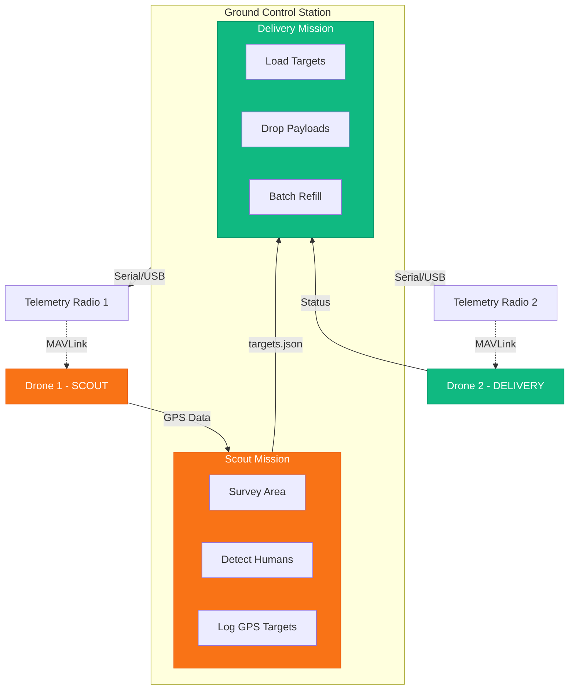

# Multi-Drone Mission Orchestrator

A Python-based system for orchestrating dual-drone missions with Scout (survey/detection) and Delivery (payload drop) capabilities using pymavlink. Cross-platform compatible with Linux, Windows, and macOS.

## Overview

This system controls two drones via USB telemetry radios or network connections:

- **Scout Drone**: Surveys a KML-defined area, detects humans using YOLO with BoT-SORT tracking, and logs GPS coordinates of detected targets.
- **Delivery Drone**: Performs payload drops at detected locations in batches, with refill workflow support.



## Features

- **Lawnmower Survey Pattern**: Efficient coverage paths generated from KML polygons with configurable sweep spacing and waypoint intervals.
- **Real-time Human Detection**: YOLO with BoT-SORT tracking for accurate unique counting, reducing duplicate detections.
- **RTSP Video Feed**: Live video display with detection overlays from SIYI camera systems.
- **GPS Geotagging**: Logs detected human locations with precise GPS coordinates.
- **Batch Payload Delivery**: Payload capacity management with interactive refill workflow.
- **Comprehensive Safety Features**: Battery monitoring, GPS/EKF status checks, voltage thresholds, and automatic RTL failsafe.
- **Cross-Platform Support**: Compatible with Linux, Windows, and macOS with automatic serial port detection.

## Project Structure

```
ELKa-2026-Final-Mission-/
├── main.py                  # Main orchestration script
├── config.py                # Central configuration (all tunable parameters)
├── drone_controller.py      # MAVLink wrapper class with safety checks
├── kml_processor.py         # KML parsing and path generation
├── human_detector.py        # YOLO with BoT-SORT detection
├── video_display.py         # RTSP viewer with overlays
├── scout_mission.py         # Scout drone mission logic
├── delivery_mission.py      # Delivery drone mission logic
├── cross_platform.py        # OS-agnostic utilities (port discovery, timing)
├── requirements.txt         # Python dependencies
├── PRE_FLIGHT_CHECKLIST.md  # Pre-flight safety checklist
├── tests/
│   ├── test_drone_connection.py  # Drone connectivity test
│   ├── test_rtsp_stream.py       # Video stream test
│   └── test_kml_path.py          # Path planning test
├── config/
│   └── survey_area.kml      # Survey area definition
├── models/
│   └── best.pt              # YOLO model weights
└── output/
    └── targets.json         # Detected human locations
```

## Requirements

- Python 3.8+
- ArduPilot-compatible flight controller
- USB telemetry radios or network connection
- SIYI camera system (for RTSP video feed)
- YOLO model weights (best.pt)

## Installation

### Linux (Arch/Ubuntu)

```bash
cd /path/to/ELKa-2026-Final-Mission-
pip install -r requirements.txt
```

### Windows

```powershell
cd C:\path\to\ELKa-2026-Final-Mission-
pip install -r requirements.txt
```

### macOS

```bash
cd /path/to/ELKa-2026-Final-Mission-
pip install -r requirements.txt
```

## Configuration

All tunable parameters are centralized in `config.py`. Key settings include:

### Connection Settings

```python
class MissionConfig:
    # Windows: "COM3", "COM4", etc.
    # Linux: "/dev/ttyACM0", "/dev/ttyUSB0", etc.
    # macOS: "/dev/tty.usbmodem*", "/dev/tty.usbserial*"
    
    SCOUT_CONNECTION = "/dev/ttyACM1"      # Scout drone (4S battery)
    DELIVERY_CONNECTION = "/dev/ttyACM0"   # Delivery drone (6S battery)
    
    # Baud rate for serial connections
    SCOUT_BAUD = 57600
    DELIVERY_BAUD = 57600
```

### Flight Parameters

| Parameter | Default | Description |
|-----------|---------|-------------|
| `SCOUT_ALTITUDE` | 10.0 m | Survey altitude for Scout drone |
| `DELIVERY_ALTITUDE` | 10.0 m | Cruise altitude for Delivery drone |
| `DROP_ALTITUDE` | 5.0 m | Altitude to descend to for payload drops |
| `SURVEY_SPEED` | 5.0 m/s | Survey flight speed |
| `SWEEP_SPACING` | 15.0 m | Lawnmower pattern line spacing |
| `WAYPOINT_INTERVAL` | 20.0 m | Distance between waypoints |

### Detection Settings

| Parameter | Default | Description |
|-----------|---------|-------------|
| `DETECTION_CONFIDENCE` | 0.7 | Minimum confidence threshold (70%) |
| `IOU_THRESHOLD` | 0.45 | NMS threshold for duplicate reduction |
| `DETECTION_INTERVAL` | 3 | Process every Nth frame |
| `TRACKER_BUFFER` | 60 | Track memory in frames |

### Payload Settings

| Parameter | Default | Description |
|-----------|---------|-------------|
| `PAYLOAD_CAPACITY` | 5 | Maximum payloads per flight |
| `DROP_SERVO_CHANNEL` | 9 | Servo channel for release mechanism |
| `DROP_SERVO_PWM` | 1900 | PWM value for drop position |
| `LOAD_SERVO_PWM` | 1100 | PWM value for closed position |
| `DROP_DURATION` | 5.0 s | Hover duration during drop |

### Safety Thresholds

| Parameter | Default | Description |
|-----------|---------|-------------|
| `SCOUT_MIN_BATTERY_VOLTAGE` | 14.0 V | 4S LiPo minimum (3.5V/cell) |
| `SCOUT_MIN_BATTERY_PERCENT` | 20% | Minimum battery percentage |
| `DELIVERY_MIN_BATTERY_VOLTAGE` | 21.0 V | 6S LiPo minimum (3.5V/cell) |
| `DELIVERY_MIN_BATTERY_PERCENT` | 20% | Minimum battery percentage |
| `MAX_DISTANCE_FROM_HOME` | 500.0 m | RTL trigger distance |

### Video Settings

```python
RTSP_URL = "rtsp://192.168.144.25:8554/main.264"  # SIYI camera
VIDEO_WIDTH = 640
VIDEO_HEIGHT = 360
```

## Testing

Run tests before each mission to verify hardware connectivity:

```bash
cd tests
conda activate Nidar  # Or your environment

# Test 1: Drone connections (connects both drones, sets GUIDED mode)
python test_drone_connection.py

# Test 2: RTSP video stream
python test_rtsp_stream.py

# Test 3: KML path planning (generates output KML with flight path)
python test_kml_path.py --input ../config/survey_area.kml --output flight_path.kml
```

### KML Path Test Options

| Option | Description | Default |
|--------|-------------|---------|
| `--input`, `-i` | Input KML polygon file | (required) |
| `--output`, `-o` | Output KML with path | `<input>_path.kml` |
| `--spacing` | Sweep line spacing (m) | `15` |
| `--interval` | Waypoint interval (m) | `20` |
| `--altitude` | Flight altitude (m) | `10` |

## Usage

### Full Mission (Scout + Delivery)

```bash
python main.py
```

### Scout Mission Only

```bash
python main.py --scout-only
```

### Delivery Mission Only

```bash
python main.py --delivery-only --targets output/targets.json
```

### Command-Line Options

| Option | Description | Default |
|--------|-------------|---------|
| `--scout-only` | Run only scout mission | - |
| `--delivery-only` | Run only delivery mission | - |
| `--scout-port` | Scout drone connection string | `/dev/ttyUSB0` |
| `--delivery-port` | Delivery drone connection string | `/dev/ttyUSB1` |
| `--baud` | Serial baud rate | `57600` |
| `--kml` | KML survey area file | `config/survey_area.kml` |
| `--altitude` | Survey altitude (m) | `10` |
| `--capacity` | Payload capacity | `5` |

## Mission Workflow

### Phase 1: Scout Mission

1. Load KML polygon and generate lawnmower waypoints.
2. Connect to Scout drone, verify safety checks (GPS, EKF, battery).
3. Set GUIDED mode and arm.
4. Takeoff to survey altitude (default: 10m).
5. Fly survey pattern while processing RTSP video.
6. Detect humans using YOLO with BoT-SORT tracking.
7. Log GPS coordinates to `output/targets.json`.
8. Return to launch (RTL) when survey is complete.

### Phase 2: Delivery Mission

1. Load targets from `output/targets.json`.
2. Split targets into batches based on payload capacity (default: 5).
3. For each batch:
   - Verify safety checks and arm.
   - Takeoff to cruise altitude (10m).
   - Navigate to each target location.
   - Descend to drop altitude (5m), trigger servo, drop payload.
   - Ascend to cruise altitude and continue.
   - RTL after batch completion.
   - Wait for user refill confirmation before next batch.

## Hardware Setup

### USB Telemetry Radios

```bash
# Linux: List available ports
ls -la /dev/ttyUSB* /dev/ttyACM*

# Windows: Check Device Manager for COM ports
# macOS: ls /dev/tty.usb*
```

### Automatic Port Discovery

The system includes automatic telemetry radio detection:

```python
from cross_platform import PortFinder

finder = PortFinder()
ports = finder.find_telemetry_ports()
print(ports)  # ['/dev/ttyUSB0', '/dev/ttyACM0', ...]

# Interactive selection
selected = finder.select_port("Select Scout radio")
```

### Payload Servo Configuration

```python
DROP_SERVO_CHANNEL = 9    # Servo channel on flight controller
DROP_SERVO_PWM = 1900     # PWM for drop/release position
LOAD_SERVO_PWM = 1100     # PWM for closed/loaded position
```

## Safety Features

The system implements multiple safety checks before and during flight:

- **Pre-arm Checks**:
  - Battery voltage and percentage verification
  - GPS 3D fix confirmation
  - EKF position estimation status (critical for GUIDED mode)
  - Home position validation

- **In-flight Monitoring**:
  - Continuous battery voltage monitoring
  - Distance from home tracking
  - Automatic RTL on low battery or geofence breach

- **Post-landing Safety**:
  - Altitude verification before refill prompt
  - Forced disarm if still armed after landing

## Keyboard Controls

| Key | Action |
|-----|--------|
| `Q` | Quit mission (triggers RTL) |
| `S` | Save screenshot |
| `Space` | Pause/Resume |

## Testing with SITL

For development and testing without real hardware:

```bash
# Terminal 1: SITL for Scout drone
sim_vehicle.py -v ArduCopter --instance 0 --out=udp:127.0.0.1:14550

# Terminal 2: SITL for Delivery drone
sim_vehicle.py -v ArduCopter --instance 1 --out=udp:127.0.0.1:14560

# Terminal 3: Run mission with SITL connections
python main.py \
    --scout-port "udpin:127.0.0.1:14550" \
    --delivery-port "udpin:127.0.0.1:14560"
```

## Troubleshooting

### Connection Issues

- Verify USB ports are accessible: `sudo chmod 666 /dev/ttyUSB*`
- Check baud rate matches telemetry radio configuration.
- Ensure no other applications are using the serial port.

### Detection Issues

- Verify YOLO model file exists at `models/best.pt`.
- Check RTSP stream is accessible: `ffplay rtsp://192.168.144.25:8554/main.264`
- Adjust `DETECTION_CONFIDENCE` if too few or too many detections.

### GPS/EKF Failures

- Wait for GPS 3D fix (usually 30-60 seconds outdoors).
- Ensure clear sky view for GPS antenna.
- Check EKF status in ground control software.

## Dependencies

Key Python packages (see `requirements.txt` for full list):

- `pymavlink`: MAVLink protocol library
- `ultralytics`: YOLO object detection
- `opencv-python`: Video processing
- `pyserial`: Serial port communication
- `pykml`: KML file parsing
- `shapely`: Geometric operations

## License

MIT License