# Multi-Drone Mission Orchestrator

A comprehensive Python system for orchestrating dual-drone missions with Scout (survey/detection) and Delivery (payload drop) capabilities using pymavlink.

## Overview

This system controls two drones via USB telemetry radios:

- **Drone 1 (Scout)**: Surveys an area defined by a KML polygon, detects humans using YOLO+BoT-SORT, and logs GPS coordinates
- **Drone 2 (Delivery)**: Reads detected targets and performs payload drops in batches

```mermaid
flowchart TB
    subgraph GCS["🖥️ GCS LAPTOP"]
        subgraph Scout["Scout Mission"]
            S1["📍 Survey Area"]
            S2["👁️ Detect Humans"]
            S3["📝 Log GPS Targets"]
        end
        
        subgraph Delivery["Delivery Mission"]
            D1["📂 Load Targets"]
            D2["📦 Drop Payloads"]
            D3["🔄 Batch Refill"]
        end
        
        Scout -->|targets.json| Delivery
    end
    
    GCS -->|"/dev/ttyUSB0"| Radio1["📡 Telemetry Radio"]
    GCS -->|"/dev/ttyUSB1"| Radio2["📡 Telemetry Radio"]
    
    Radio1 -.->|"MAVLink"| Drone1["🚁 Drone 1<br/>SCOUT"]
    Radio2 -.->|"MAVLink"| Drone2["🚁 Drone 2<br/>DELIVERY"]
    
    Drone1 -->|"GPS coordinates"| Scout
    Drone2 -->|"Status"| Delivery

    style Scout fill:#f97316,stroke:#ea580c,color:#fff
    style Delivery fill:#10b981,stroke:#059669,color:#fff
    style Drone1 fill:#f97316,stroke:#ea580c,color:#fff
    style Drone2 fill:#10b981,stroke:#059669,color:#fff
```



## Features

- **Lawnmower Survey Pattern**: Generates efficient coverage paths from KML polygons
- **Real-time Human Detection**: YOLO+BoT-SORT tracking with unique counting
- **RTSP Video Feed**: Live video display with detection overlays
- **GPS Geotagging**: Logs detected human locations with coordinates
- **Batch Payload Delivery**: Manages payload capacity with refill workflow
- **Safety Features**: Battery monitoring, GPS checks, RTL failsafe

## Project Structure

```
ELKa-2026-Final-Mission-/
├── main.py                # Main orchestration script
├── config.py              # Central configuration
├── drone_controller.py    # MAVLink wrapper class
├── kml_processor.py       # KML parsing + path generation
├── human_detector.py      # YOLO+BoT-SORT detection
├── video_display.py       # RTSP viewer with overlays
├── scout_mission.py       # Scout drone logic
├── delivery_mission.py    # Delivery drone logic
├── requirements.txt       # Python dependencies
├── config/
│   └── survey_area.kml    # Survey area definition
├── models/
│   └── best.pt            # YOLO model weights
└── output/
    ├── targets.json       # Detected human locations
    └── screenshots/       # Captured frames
```

## Installation

1. **Clone the repository**:
   ```bash
   cd /home/dj/Projects/ELKa-2026-Final-Mission-
   ```

2. **Install dependencies**:
   ```bash
   pip install -r requirements.txt
   ```

3. **Verify YOLO model**:
   ```bash
   ls -la models/best.pt
   ```

## Configuration

Edit `config.py` to customize mission parameters:

```python
class MissionConfig:
    # Connection strings
    SCOUT_CONNECTION = "/dev/ttyUSB0"
    DELIVERY_CONNECTION = "/dev/ttyUSB1"
    
    # Altitudes
    SCOUT_ALTITUDE = 25.0  # meters
    DELIVERY_ALTITUDE = 15.0  # meters
    
    # Payload
    PAYLOAD_CAPACITY = 5
    DROP_DURATION = 5.0  # seconds
    
    # Video
    RTSP_URL = "rtsp://192.168.144.25:8554/main.264"
```

## Usage

### Full Mission (Scout + Delivery)

```bash
python main.py
```

### Scout Mission Only

```bash
python main.py --scout-only
```

### Delivery Mission Only

```bash
python main.py --delivery-only --targets output/targets.json
```

### Custom Parameters

```bash
python main.py \
    --kml config/custom_area.kml \
    --scout-port /dev/ttyUSB0 \
    --delivery-port /dev/ttyUSB1 \
    --altitude 30 \
    --capacity 3 \
    --rtsp "rtsp://192.168.1.100:8554/stream"
```

### Command-Line Options

| Option | Description | Default |
|--------|-------------|---------|
| `--scout-only` | Run only scout mission | - |
| `--delivery-only` | Run only delivery mission | - |
| `--scout-port` | Scout drone connection | `/dev/ttyUSB0` |
| `--delivery-port` | Delivery drone connection | `/dev/ttyUSB1` |
| `--baud` | Serial baud rate | `57600` |
| `--kml` | KML survey area file | `config/survey_area.kml` |
| `--targets` | Targets JSON file | `output/targets.json` |
| `--rtsp` | RTSP stream URL | (from config) |
| `--altitude` | Survey altitude (m) | `25` |
| `--capacity` | Payload capacity | `5` |
| `--simulate` | Simulation mode | - |

## Mission Workflow

### Phase 1: Scout Mission

1. Load KML polygon and generate lawnmower waypoints
2. Connect to Scout drone via USB telemetry
3. Set GUIDED mode, arm, and takeoff
4. Fly survey pattern while processing video
5. Detect humans using YOLO+BoT-SORT
6. Log GPS coordinates to `targets.json`
7. RTL when survey complete

### Phase 2: Delivery Mission

1. Load targets from `targets.json`
2. Split into batches of PAYLOAD_CAPACITY
3. For each batch:
   - Connect, arm, takeoff
   - Navigate to each target
   - Hover and trigger payload drop
   - RTL after batch
   - Wait for user refill confirmation

## Hardware Setup

### USB Telemetry Radios

1. Connect Scout radio to USB (usually `/dev/ttyUSB0`)
2. Connect Delivery radio to USB (usually `/dev/ttyUSB1`)
3. Verify connections:
   ```bash
   ls -la /dev/ttyUSB*
   ```

### RTSP Video Feed

Configure your camera/transmitter to stream to the specified RTSP URL.

### Payload Servo

Configure the drop servo channel in `config.py`:
```python
DROP_SERVO_CHANNEL = 9
DROP_SERVO_PWM = 1900  # Drop position
LOAD_SERVO_PWM = 1100  # Loaded position
```

## Output Files

### targets.json

```json
{
  "mission_id": "scout-20260113-233240",
  "timestamp": "2026-01-13T23:35:00",
  "total_targets": 5,
  "targets": [
    {
      "id": 1,
      "lat": 12.970123,
      "lon": 77.591456,
      "alt": 25.0,
      "confidence": 0.87,
      "timestamp": "2026-01-13T23:33:15",
      "track_id": 1
    }
  ]
}
```

## Keyboard Controls (During Mission)

| Key | Action |
|-----|--------|
| `Q` | Quit mission (triggers RTL) |
| `S` | Save screenshot |
| `Space` | Pause/Resume |

## Safety Notes

- Always pre-flight check both drones
- Test in simulation (SITL) before real flights
- Ensure GPS lock before arming
- Monitor battery levels continuously
- Keep visual line of sight

## Testing with SITL

```bash
# Terminal 1: Start SITL for Scout (instance 0)
sim_vehicle.py -v ArduCopter --instance 0 --out=udp:127.0.0.1:14550

# Terminal 2: Start SITL for Delivery (instance 1)
sim_vehicle.py -v ArduCopter --instance 1 --out=udp:127.0.0.1:14560

# Terminal 3: Run mission with SITL connections
python main.py \
    --scout-port "udpin:127.0.0.1:14550" \
    --delivery-port "udpin:127.0.0.1:14560"
```

## License

MIT License - See LICENSE file